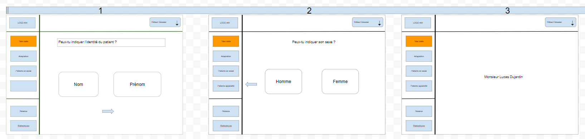

# UserInterfaceAW
## Creation of user interface from AW wireframe.

### Stack and tools

React
Ant-Design
React Router

### Goal

Creation of a user interface and a small registration process for a new patient. 

The interface should allow to navigate between the different items of the right side menu and to save the data of a created patient. 

The interface should implement a grid system (similar to Bootstrap).

I chose to use Ant-Design, a well-documented library of interface components provided to realize this project. 

I chose to go further by integrating other functionalities.

### Wireframe 

